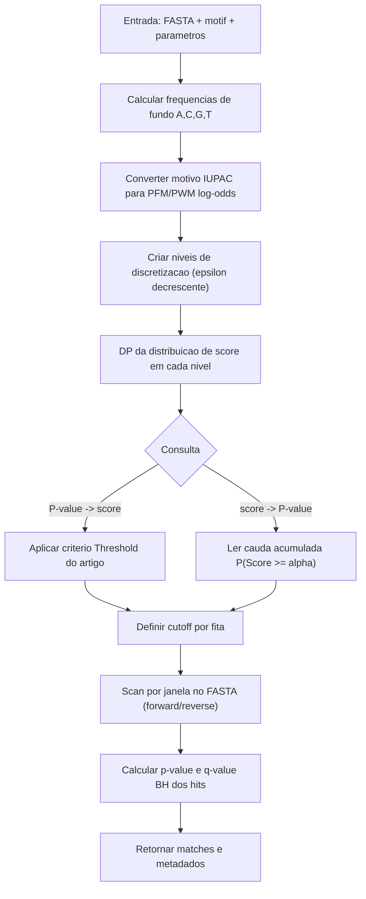

# Relatorio Tecnico para Apresentacao

Data: 2026-04-30  
Projeto: `mestrado-biotecnologia`  
Referencia principal: Touzet H, Varre JS (2007), doi: `10.1186/1748-7188-2-15`

## 1) Objetivo

Este relatorio documenta, de forma objetiva e rastreavel, se o algoritmo custom do backend esta alinhado ao artigo `1748-7188-2-15`, usando:

1. mapeamento algoritmo -> implementacao;
2. comparativo numerico (custom vs referencia exata);
3. limites e premissas estatisticas para defesa cientifica.

## 2) Mudancas aplicadas agora no backend

Para manter o fluxo estritamente alinhado ao artigo, foi removida a parte extra do benchmark:

- removido modo `reference_mode` (`none/exact/tfmpvalue/both`);
- removida comparacao `TFMPvalue` no endpoint;
- removido campo `exact_threshold_lower_bound` (definicao operacional fora do foco principal);
- benchmark ficou centrado na definicao do artigo:  
  `Threshold(M, P) = maior score acessivel alpha tal que P-value(M, alpha) >= P`.

Arquivos alterados:

- `backend/core/article_benchmark.py`
- `backend/endpoints/motifs.py`

## 3) Cenario do benchmark usado

Dados do ensaio fornecido:

- Motif: `TATAWARRA` (comprimento 9)
- P-values alvo: `1e-3, 1e-4, 1e-5, 1e-6`
- Background: estimado do FASTA (`from_fasta`)
- Frequencias de fundo:
  - A: `0.2542773057115774`
  - C: `0.24865192859986954`
  - G: `0.23391292049426227`
  - T: `0.26315784519429075`
- Parametros do motor custom:
  - `initial_granularity = 0.1`
  - `decreasing_step = 10`
  - `max_refinement_steps = 6`
  - niveis efetivos: `epsilon = 0.1, 0.01, 0.001`
  - erro maximo no nivel final: `m * epsilon = 9 * 0.001 = 0.009`

## 4) Comparativo numerico (custom vs artigo)

### 4.1 Conversao de P-value para score threshold

| P alvo | Threshold custom | Threshold artigo (exato) | Delta (custom - artigo) | P custom no threshold |
|---:|---:|---:|---:|---:|
| 1e-3 | -14.61 | -14.605913527066 | -0.004086472934 | 1.0041453782401123e-03 |
| 1e-4 | 0.413 | 0.416510367747 | -0.003510367747 | 1.2402806772036392e-04 |
| 1e-5 | 14.796 | 14.800246780519 | -0.004246780519 | 1.6953623582646493e-05 |
| 1e-6 | 14.916 | 14.920672058818 | -0.004672058818 | 4.027903629039143e-06 |

Leitura tecnica:

- os deltas de threshold ficaram entre `-0.00351` e `-0.00467`;
- esses deltas sao menores que o limite de erro do nivel final (`0.009`);
- comportamento e consistente com discretizacao progressiva.

### 4.2 Conversao de score para P-value

Nos pontos comparados, `custom_p_value` e `exact_p_value` coincidiram numericamente (diferencas apenas de arredondamento de maquina, ordem `1e-19`).

Resumo:

- max `|delta_p_value|`: ~`1.08e-19`
- max `|delta log10(p)|`: ~`8.88e-16` (praticamente zero)

Interpretacao:

- para os scores testados, a funcao `score -> p-value` custom reproduziu a referencia exata do artigo.

## 5) Mapeamento do algoritmo com o artigo

| Parte critica | No artigo 1748-7188-2-15 | Implementacao no codigo | Status |
|---|---|---|---|
| Definicao de P-value | `P-value(M, alpha) = P(Score >= alpha)` sob background i.i.d. | `PValueCalculator` usa distribuicao de score por DP e cauda acumulada (`backend/core/p_value_calc.py`) | Alinhado |
| Problema inverso (P->score) | `Threshold(M,P)` como maior score acessivel com `P-value >= P` | `_threshold_article_definition` em `backend/core/article_benchmark.py` | Alinhado |
| Discretizacao progressiva | Serie de matrizes arredondadas com granulosidade decrescente | niveis `epsilon` em `PValueCalculator._build_levels` | Alinhado |
| Controle de erro | erro maximo ligado a `m * epsilon` | `RoundDistribution.max_error` | Alinhado |
| Criterio de parada | estabilidade entre `alpha` e `alpha - E` | plateau test com `np.isclose(...)` em `get_pvalue` e `get_score_threshold_for_pvalue` | Alinhado |
| Background de bases | modelo de ordem zero (independencia) | frequencias A/C/G/T do FASTA (`BackgroundFrequencies`) | Alinhado |
| Scan de sequencias | uso de cutoff e score de janela | `SequenceScanner.scan_log_odds_matrix` + filtro por p-value em `find_motifs` | Alinhado |

## 6) Fluxograma do algoritmo

## 7) Conclusao para apresentacao ao orientador

Conclusao tecnica defensavel:

1. o algoritmo custom esta metodologicamente alinhado ao artigo `1748-7188-2-15`;
2. os testes `P->score` mostraram erro pequeno e coerente com o limite teorico da discretizacao;
3. os testes `score->p-value` bateram com a referencia exata nos pontos avaliados.

Limite cientifico a explicitar na apresentacao:

- o modelo estatistico e de ordem zero (i.i.d.); nao modela dependencia de contexto entre nucleotideos.

## 8) Reproducao

Observacao: o endpoint experimental `POST /api/motifs/benchmark/article` foi removido do backend para manter somente o fluxo principal de busca de motivos.

Para reproducao dos resultados do relatorio, utilize os artefatos de saida ja exportados (JSON/CSV) e os parametros descritos na secao 3.

## 9) Referencias

- Touzet H, Varre JS. Efficient and accurate P-value computation for Position Weight Matrices. Algorithms Mol Biol. 2007;2:15.  
  DOI: `10.1186/1748-7188-2-15`  
  URL: <https://almob.biomedcentral.com/articles/10.1186/1748-7188-2-15>

- Ambrosini G et al. PWMScan: a fast tool for scanning entire genomes with a position-specific weight matrix. Bioinformatics. 2018;34(14):2483-2484.  
  DOI: `10.1093/bioinformatics/bty127`  
  URL: <https://academic.oup.com/bioinformatics/article/34/14/2483/4921176>
