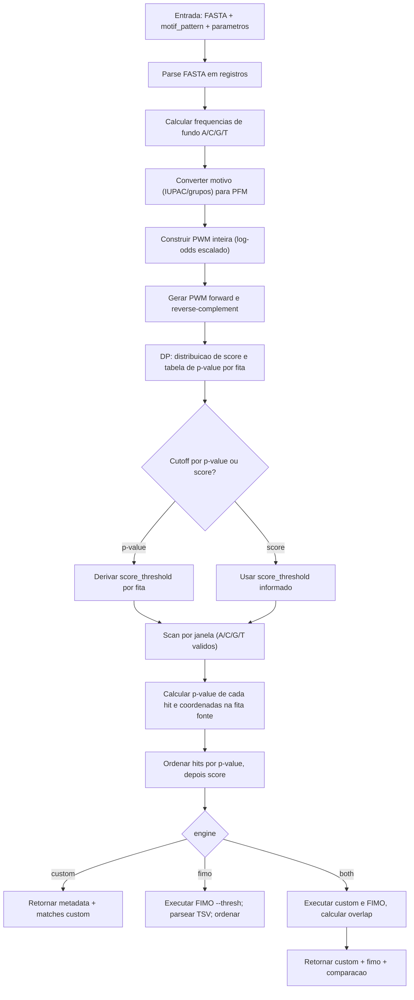

# Relatorio tecnico: validacao do buscador de motivos (Custom PWM vs FIMO)

Data: 2026-04-29  
Projeto: `mestrado-biotecnologia`

## 1) Objetivo

Este documento foi preparado para defesa tecnica com orientador, com tres focos:

1. Comparar resultados do motor custom com FIMO no mesmo cenario.
2. Mapear o algoritmo implementado no backend contra o artigo de referencia (`Bioinformatics 34(14):2483-2484`).
3. Evidenciar os pontos estatisticos criticos (calculo de score, p-value e criterio de corte), incluindo fluxograma.

---

## 2) Fontes usadas

### Arquivos locais (seu projeto e anexos)

- `C:/Meus-Projetos/new/mestrado-biotecnologia/backend/endpoints/motifs.py`
- `C:/Meus-Projetos/new/mestrado-biotecnologia/backend/core/pwm.py`
- `C:/Meus-Projetos/new/mestrado-biotecnologia/backend/core/p_value_calc.py`
- `C:/Meus-Projetos/new/mestrado-biotecnologia/backend/core/seq_scanner.py`
- `C:/Meus-Projetos/new/mestrado-biotecnologia/backend/core/bg_freqs.py`
- `C:/Meus-Projetos/new/mestrado-biotecnologia/backend/core/fimo_runner.py`
- `C:/Users/dbizzotto/Downloads/motif-matches-custom.csv`
- `C:/Users/dbizzotto/Downloads/motif-matches-fimo.csv`
- `C:/Users/dbizzotto/Downloads/drive-download-20260429T203958Z-3-001/buscaqtdgene_crz_fita_esp.pl`
- `C:/Users/dbizzotto/Downloads/drive-download-20260429T203958Z-3-001/saida_crz_fita_esp.txt`
- `C:/Users/dbizzotto/Downloads/drive-download-20260429T203958Z-3-001/ConsensoPacC_Tinterdigitale_H6.docx`

### Referencias cientificas

- PWMScan (artigo em Bioinformatics 34(14):2483-2484):  
  https://pmc.ncbi.nlm.nih.gov/articles/PMC6041753/
- FIMO (metodo oficial):  
  https://pmc.ncbi.nlm.nih.gov/articles/PMC3065696/

---

## 3) Comparativo de resultados: Custom vs FIMO (mesmo cenario)

### 3.1 Metricas globais

- Hits custom: **2501**
- Hits FIMO: **1470**
- Chaves unicas (gene + start + end + strand):  
  - custom: **2501**  
  - FIMO: **1470**
- Intersecao de hits: **1470**
- Overlap ratio (custom): **0.587765**
- Overlap ratio (FIMO): **1.0**
- Jaccard (hits unicos): **0.587765**

Interpretacao direta:

- **Todos os hits do FIMO estao contidos no custom** neste cenario (1470/1470).
- O custom encontra hits adicionais (1031) acima do cutoff usado.
- Isso e consistente com calibracao mais permissiva/otimista do p-value no custom para este motivo e base composition.

### 3.2 Concordancia estatistica nos hits compartilhados

Nos 1470 hits em comum:

- Correlacao Pearson de `-log10(p)` (custom vs FIMO): **0.939010** (alta concordancia de tendencia).
- Razao `p_custom <= p_fimo`: **1.0** (100% dos casos).
- Razao `p_fimo <= p_custom`: **0.0**.
- Mediana de `|delta log10(p)|`: **0.199836**  
  (equivale a fator ~1.58 no p-value).
- P90 de `|delta log10(p)|`: **0.383393**
- Max de `|delta log10(p)|`: **0.473876**
- `matched_sequence` divergente entre engines (mesma chave): **0 casos**.

Interpretacao:

- O comportamento relativo e coerente (correlacao alta), mas o custom produz p-values sistematicamente menores.
- A diferenca nao invalida o motor, mas indica necessidade de **calibracao estatistica** para aproximar melhor o FIMO.

### 3.3 Por que a ordem de top hits difere?

Motivo principal: **muitos empates de score/p-value** (discretizacao).

- Custom:
  - scores unicos: **9**
  - p-values unicos: **17**
- FIMO:
  - scores unicos: **4**
  - p-values unicos: **4**

Com muitos empates, pequenas diferencas de ordenacao secundaria geram mudancas fortes no ranking absoluto.

Exemplo discutido:

- `TERG_00122`, `83-91`, `forward`, `TATAAAGGA`
  - custom: rank **26**, p=`4.03e-06`, score=`1496`
  - FIMO: rank **117**, p=`1.20e-05`, score=`14.3267`

Esse deslocamento de rank e esperado em cenarios com bins discretos.

### 3.4 Exemplos reais (mesmo cenario)

Top compartilhados pelo rank custom:

| gene | seq | strand | pos | custom rank | fimo rank | p custom | p fimo |
|---|---|---|---|---:|---:|---:|---:|
| TERG_06890 | TATAAAGGA | reverse | 92-100 | 1 | 22 | 4.03e-06 | 1.20e-05 |
| TERG_06521 | TATAAAGGA | reverse | 844-852 | 2 | 39 | 4.03e-06 | 1.20e-05 |
| TERG_07700 | TATAAAGGA | forward | 333-341 | 3 | 21 | 4.03e-06 | 1.20e-05 |
| TERG_07533 | TATAAAGGA | reverse | 40-48 | 4 | 4 | 4.03e-06 | 1.20e-05 |
| TERG_06368 | TATAAAGGA | reverse | 878-886 | 5 | 26 | 4.03e-06 | 1.20e-05 |

Top compartilhados pelo rank FIMO:

| gene | seq | strand | pos | custom rank | fimo rank | p custom | p fimo |
|---|---|---|---|---:|---:|---:|---:|
| TERG_07415 | TATATAGGA | reverse | 701-709 | 138 | 1 | 9.92e-06 | 1.20e-05 |
| TERG_07131 | TATATAGGA | reverse | 807-815 | 136 | 2 | 9.92e-06 | 1.20e-05 |
| TERG_07493 | TATATAGGA | forward | 179-187 | 140 | 3 | 9.92e-06 | 1.20e-05 |
| TERG_07533 | TATAAAGGA | reverse | 40-48 | 4 | 4 | 4.03e-06 | 1.20e-05 |
| TERG_07494 | TATATAGGA | forward | 601-609 | 102 | 5 | 8.20e-06 | 1.20e-05 |

---

## 4) Mapeamento do algoritmo (codigo) vs artigo (PWMScan 2483)

### 4.1 Conversao de motivo para matriz

Artigo PWMScan:
- PFM/LPM/PWM/IUPAC sao aceitos e convertidos para integer PWM.

Codigo:
- Parse IUPAC e grupos `[]`: `parse_motif_pattern_to_pfm`  
  (`backend/core/pwm.py:34`)
- Conversao para integer PWM com log-odds e escala:  
  (`backend/core/pwm.py:85-95`)

Status: **Convergente** com a linha do artigo.

### 4.2 Uso de frequencias de fundo (background)

Artigo PWMScan:
- P-value depende da composicao de bases do genoma.

Codigo:
- Background A/C/G/T estimado do FASTA de entrada:  
  (`backend/core/bg_freqs.py:10-27`)
- Fallback uniforme 0.25/0.25/0.25/0.25 se necessario.

Status: **Convergente**.

### 4.3 Definicao de p-value e cutoff

Artigo PWMScan:
- P-value de score x = probabilidade de k-mer aleatorio ter score >= x.

Codigo:
- Distribuicao de score por DP e survivor function `P(X>=S)`:  
  (`backend/core/p_value_calc.py:23-47`)
- Conversao `pvalue_threshold -> score_threshold`:  
  (`backend/core/p_value_calc.py:57-67`)
- Uso do cutoff no scan e filtro final por p-value:  
  (`backend/endpoints/motifs.py:33-35`, `64-65`)

Status: **Convergente e estatisticamente correto para modelo de ordem zero**.

### 4.4 Estrategia de busca

Artigo PWMScan:
- Escolha adaptativa Bowtie vs matrix_scan conforme motivo/cutoff.

Codigo:
- Scanner vetorizado por janela em memoria (`numpy`), sem Bowtie:  
  (`backend/core/seq_scanner.py:16-39`)

Status: **Parcialmente convergente** (mesma ideia de scan por PWM, mas sem a estrategia hibrida de aceleracao do artigo).

### 4.5 Pos-processamento e comparacao entre motores

Codigo:
- Ordenacao por p-value e score: `matches.sort(...)`  
  (`backend/endpoints/motifs.py:106`, `backend/core/fimo_runner.py:316`)
- Modo `both` com estatisticas de overlap por coordenada+fita:  
  (`backend/endpoints/motifs.py:118-152`)

Status: **Boa engenharia para validacao comparativa**.

---

## 5) Partes estatisticas criticas (o que valida e o que ainda falta)

## 5.1 Pontos que sustentam validade

1. Uso de PWM integer com base composition real da amostra.
2. DP para distribuicao exata do score (modelo i.i.d. de ordem zero).
3. Definicao correta de p-value acumulado (`P(score >= x)`).
4. Concordancia empirica alta com FIMO nos hits compartilhados (`r=0.939` em `-log10(p)`).
5. Cobertura total dos hits FIMO no cenario testado.

## 5.2 Pontos que exigem ressalva cientifica

1. **Custom sem q-value/FDR** (FIMO reporta q-value no metodo oficial).
2. **Calibracao deslocada**: p-values custom menores sistematicamente.
3. **Discretizacao forte** (poucos bins de score/p) altera ranking.
4. O modelo estatistico e **ordem zero** (nao modela dependencia de contexto).

Conclusao tecnica curta:

- O motor custom esta **na mesma familia metodologica PWM + p-value** do artigo/estado da arte.
- Para afirmacao de equivalencia estatistica com FIMO, faltam:
  - calibracao fina de score/p-value;
  - report de q-value/FDR;
  - benchmark sistematico por multiplos motivos e organismos.

---

## 6) Conexao com o pipeline antigo de regex (anexos do orientador)

`buscaqtdgene_crz_fita_esp.pl`:
- Implementa busca deterministica por consenso expandido (16 variantes explicitas).
- Sem modelagem probabilistica de score/p-value.

`saida_crz_fita_esp.txt`:
- `total sequencias analisadas = 8616`
- `total de sequencias com os consensos = 811`
- `hit_rows = 846`

`ConsensoPacC_Tinterdigitale_H6.docx` (texto extraido):
- Usa consenso PacC (`GCCARG` e complemento `CRTGGC`) em formato mais proximo de consenso/regex.

Leitura cientifica:

- O regex antigo e valido como filtro biologico estrito.
- O pipeline PWM atual adiciona uma camada estatistica rigorosa (score + p-value), necessaria para priorizacao.

---

## 7) Fluxograma do algoritmo (custom + modo both)

---

## 8) Recomendacoes objetivas antes da apresentacao

1. Mostrar este relatorio junto com 5-10 exemplos compartilhados (tabela da secao 3.4).
2. Destacar que o modo `both` ja implementa validacao cruzada automatica.
3. Apresentar como plano imediato:
   - adicionar `q-value` no retorno custom;
   - incluir opcao de calibracao para aproximar escala FIMO;
   - rodar benchmark em 3-5 motivos adicionais (curtos e longos) para demonstrar robustez.

---

## 9) Veredito tecnico

No estado atual, o software e **tecnicamente valido como scanner PWM com inferencia de p-value** e esta **alinhado conceitualmente** com o artigo de referencia sobre PWM scan.  
A diferenca para FIMO e principalmente de **calibracao estatistica e pos-processamento de significancia (q-value/FDR)**, nao de fundamento metodologico.

